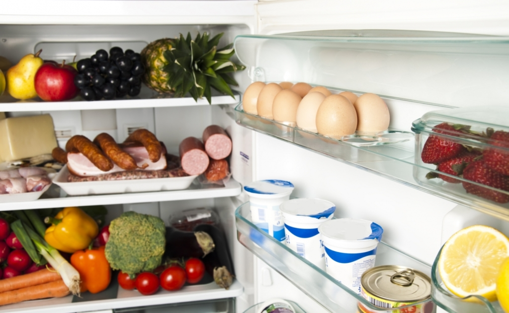
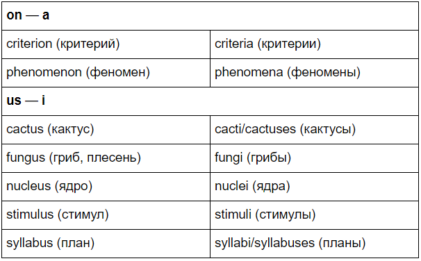
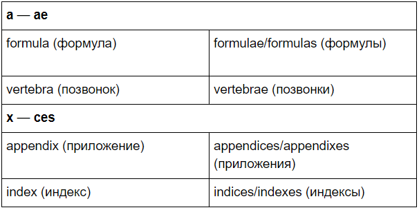
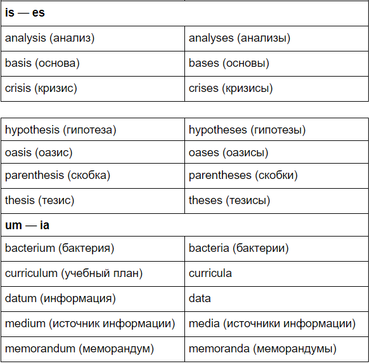
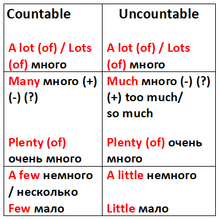
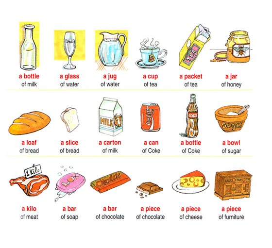

# White gold - Lesson 10

## Table of contents

- [**Warm-up**](#warmup)
- [**Grammar**](#grammar)
- [**Vocabulary**](#vocabulary)
- [**Reading**](#reading)

### Warm-up 

1. Which fridge with food do you like? Why?
2. Which fridge has healthy food and which one doesn't?
3. What kind of food do you usually buy with your family? Is it always something that you like?

---

### Grammar  

Для начала вспомним, что для единственного числа добавляем артикль **a/an**: a carpet, an orange.

Множественное формируем, убрав артикль и добавив к слову суффикс **s**: a bottle -> bottles

**-es** прибавляется к существительным, которые оканчиваются на **-sh, -ch, -s, -z, и -x**:

> Box -> boxes
> Beach -> beaches
> Waltz -> waltzes

Существительные, оканчивающиеся **на согласный + y**, типа lady, candy, family, city, в множественном числе отбрасывают y и присваивают окончание **ies**:

> Memory -> memories 

**Но если гласный, ничего не меняем**:
Donkey -> donkeys
**Примечание**: это правило не распространяется на имена собственные.

> The Kennedy family = the Kennedys 

**Неправильные существительные**

- man – men
- woman – women
- child – children
- person – people
- tooth – teeth
- foot – feet
- goose – geese
- louse – lice
- mouse – mice
- ox – oxen

**Англичане и сами смеются над нелогичностью своего языка. Вот даже, какой стишок написали:**

> We'll begin with **box**, and the plural is **boxes**;
> But the plural of **ox** should be **oxen**, not oxes.
> You may find a lone **mouse** or a nest full of **mice**,
> Yet the plural of **house** is **houses**, not hice.
> If the plural of **man** is always called **men**,
> Why shouldn't the plural of **pan** be called **pen**?
> So our English, I think, you all will agree,
> Is the craziest language you ever did see.

Существительные, оканчивающиеся на – **o**:

- echo — echoes
- hero — heroes
- potato — potatoes
- tomato — tomatoes

А некоторые прибавляют только **s**:
- auto — autos
- kangaroo — kangaroos
- kilo — kilos
- memo — memos
- photo — photos
- piano — pianos
- radio — radios
- solo — solos
- soprano — sopranos
- studio — studios
- tattoo — tattoos
- video — videos
- zoo — zoos

Ну а какие-то существительные на – **о** вообще могут позволить себе и то, и другое, в зависимости от настроения. Но все же, более стандартным считается окончание – **es**:
- memento — mementoes, mementos
- mosquito — mosquitoes, mosquitos
- tornado — tornadoes, tornados
- volcano — volcanoes, volcanos
- zero — zeroes, zeros

Некоторые существительные, оканчивающиеся на **–f** или **–fe**, меняют окончание на **–ves**:
- life — lives
- wolf — wolves
- calf — calves
- half — halves
- knife — knives
- leaf — leaves
- shelf — shelves
- thief — thieves

А какие-то слова на **-f**, **-fe** просто добавляют **s**.
Например, слово «proof» множественное число образует стандартным путем: добавляя s. Берут с него пример и эти слова:
- belief — beliefs
- chief — chiefs
- cliff — cliffs
- roof — roofs

Формы множественного числа, совпадающие с формами единственного:
- deer — олень, олени
- fish — рыба, рыбы
- salmon — лосось, сёмга
- means — способ, способы
- offspring — отпрыск, отпрыски
- series — серия, серии
- sheep — овца, овцы
- species — вид, виды 

**Итак:**
**(+)** There is a man outside the house.
There are some men on the street.
There is some water on the table.

**(-)** There isn’t a man.
There aren’t any men.
There isn’t any water.

**(?)** Is there a man?
Are there any men?
Is there any water?

**(Wh?)**
**How many** men are there outside?
**How much** water is there in the river today?

**Ex:**
> How much salt is there in Bon Aqua?
> I'm not sure. Maybe there's none.

> How much sugar is there in an apple pie?
> I think there is a lot.

---

### Vocabulary  

**tin Br / can Am** консервная банка

---

### Reading 

**Glossary**
**Fuel** - material/substance that is burned to make cars moving.
**Handful** - the amount that one hand can hold.
**Salary** - a fixed amount of money that a man gets from people for his work for them.
**BC** - abbreviation for Before Christ: is used to show that the year was before the birth of Christ.
**AD** - abbreviation for Anno Domini: used to show that the year was/is after the birth of Christ.

**BC and AD**
The idea to count years from the birth of Jesus Christ was first proposed in the year 525 by Dionysius Exiguus, a Christian monk. Standardized under the Julian and Gregorian calendars, the system spread throughout Europe and the Christian world during the centuries that followed. AD stands for *Anno Domini*, Latin for “in the year of the Lord”, while BC stands for “before Christ”.
BCE and CE
CE stands for “common (or current) era”, while BCE stands for “before the common (or current) era”. These abbreviations have a shorter history than BC and AD, although they still date from at least the early 1700s. They have been in frequent use by Jewish academics for more than 100 years, but became more widespread in the later part of the 20th century, replacing BC/AD in a number of fields, notably science and academia.

**Reed** [ riːd] - a type of plant like grass that grows near water.
**Gunpowder** [ˈɡʌnˌpaʊ.dər] - a dangerous material from which people make a “boom” or fireworks during some holiday party.
**Fireworks** - small things that make "boom" with bright colours and a loud noise. Usually it is used to celebrate special events.
**Insomnia** [ɪnˈsɑːm.ni.ə] - a problem when a person can't sleep even if he or she is very tired.
**Mummy** - a body of a dead person that is totally covered in white cloth, usually in ancient Egypt.

**White Gold or Something More**
Some unusual facts about simple things in our lives. 
• Around 0 to 100 AD, sugar was used to treat **stomach** problems in Greek and Roman civilizations.
• An **adult** has 250 grams of salt in his or her body.
• Sugar can be used like **fuel**, and today scientists are developing new fuel for cars based on sugar.
• Soldiers from Ancient Rome received their pay as a **handful** of salt. This is where the word 'salary' comes from, from the Latin word 'salarium'.
• Sea ice is **drinkable**, unlike salt water, because it contains only a little part of salt that sea water has.
• In history, the first recorded use of sugar was in Polynesia, and then people began to use it in India. Around 510 BC, sugar was found in "the reed which gives honey without bees".
• Salt was discovered in China in the 1st century AD, and it was used for medical **purpose**. Salt is also a **unique** component used in gunpowder and fireworks.
• Sugary products and sugar itself have always been a symbol of status and **prosperity**. People even began to say " sugar " to their loved ones. It is because a good man/woman is always **precious** like sugar.
• Five dollars! That was the equivalent price for a teaspoon of sugar in the 16th century.
• Refined sugar (white sugar you can find in shops) is directly connected to a lot of bad results, such as depression, allergies, **insomnia**, problems with skin, **hair loss** and even heart **diseases**!
• Salt can **preserve** anything. During the ancient period of time Egyptians used it to preserve their **mummies**.
• 40% of the world's sugar today is produced in the Brazil, India, and the European Union. 

