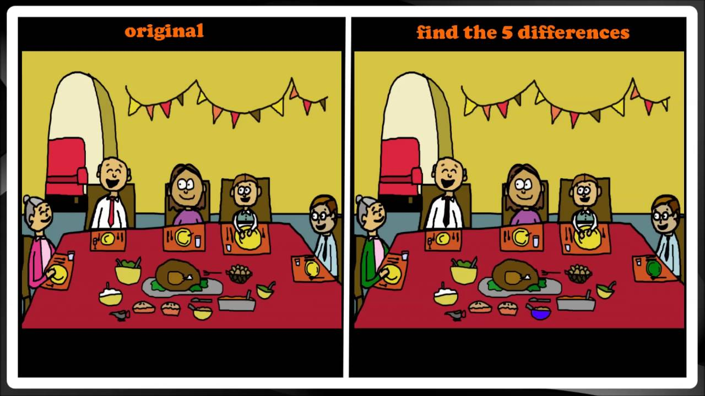

# Thanksgiving - Lesson 12

## Table of contents

- [**Warm-up**](#warmup)
- [**Vocabulary**](#vocabulary)
- [**Reading**](#reading)

### Warm-up 

**Look at the picture and find 5 difference.**

What holiday are they celebrating?

---

### Vocabulary 

- Meringue [məˈræŋ] безе
- seduce – соблазнить
- infidelity – неверность
- enchanting [ɪnˈtʃæntɪŋ] – очаровательный
- people with no decision making ability – люди без способности принимать решения
- ignorant [ˈɪɡnərənt] salespeople – невежественные продавцы
- noble thing – благородное дело
- I’m alone reed – Я одинокая тростинка
- The story book lady – Леди зачитывает книжку
- handkerchief – носовой платок
- entrance – вход
- spy on you – шпионить за вами
- That caviar is a garnish – Эта икра украшение / гарнир
- down-to-earth – приземлённый
- obscure and abstruse – непонятный и заумный
- I toss and turn – Я ворочаюсь в постели и не могу уснуть
- bottom-dweller – ничтожный тип
- zinger [ˈzɪŋər] – подколка, остроумный ответ
- remorse (inevitably [ɪnˈevɪtəblɪ]) – угрызения совести (неизбены)
- cash-only line – здесь оплата только наличными
- ‘go to the mattresses’ – выражение из фильма ‘Godfather’, означает приготовиться к войне, бороться 
- до конца
- catchy – цепляет / легко запоминается
- turn my life upside-down – повернуть жизнь на 180 градусов / перевернётся с ног на голову
- He stood you up – Он тебя прокатил
- I have a terrible cold – У меня ужасная простуда
- porcelain dolls – фарфоровые куклы
- daisies – ромашки
- stop by – прийти в гости / зайти
- I’m in the middle of the project that needs tweaking – Я работаю над проектом, где нужно держать руку на пульсе
- cut it out – прекрати

### Reading 

The tradition of Thanksgiving started with the Pilgrims who settled at Plymouth, Massachusetts. They first held a celebration of their harvest in 1621. The feast was organized by Governor William Bradford who also invited the local Wampanoag Indians to join in the meal. The first time they called the feast "Thanksgiving" was in 1623, after rain had ended a long drought.

The first national Thanksgiving Day was proclaimed by President George Washington in 1789. However, it did not become a regular holiday in the United States until 1863 when Abraham Lincoln declared that the last Thursday in November should be celebrated as Thanksgiving. Since then it has been celebrated every year in the United States. The day was made an official federal holiday and moved to the fourth Thursday of November in 1941 by President Franklin Roosevelt. 

**America's National Bird: Eagle or Turkey?**
_by Kelly Hashway_

When we think of turkey, we think of Thanksgiving. When we think of symbols for America, the bald eagle comes to mind. But did you know that Benjamin Franklin once said the wild turkey would be a better symbol of America than the bald eagle?

When the bald eagle became the official symbol of America in 1782, Benjamin Franklin had some objections. He even wrote a letter to his daughter explaining why he thought the bald eagle was a poor choice to represent our country. In the letter, Franklin said the bald eagle was a lazy thief because it let other birds catch fish in rivers and then swooped down to steal their dinners. He also said that the bald eagle was a coward because it ran away from smaller birds protecting their nests. Franklin didn’t want a bird that could be seen as a thief and a coward to represent America. He thought the symbol should be something that was both brave and honest.

Franklin’s other complaint was that the drawing of the bald eagle used in the great seal actually looked more like a wild turkey. This made Franklin compare the two birds, and he decided the wild turkey would have been a better symbol for our country. He said that the turkey was a more respectable bird since it was not afraid of others birds and was native to America.

Did Franklin really want the wild turkey to be the national symbol? We may never know for sure, but he definitely was not happy about having a symbol that could be associated with laziness, theft, and cowardice either. Franklin only expressed his concerns through a letter to his daughter, but imagine what it would have meant for our country if Franklin had rallied people around the wild turkey being used as our national symbol. Thanksgiving may have been very different.

**Answer the questions.**
1. Why did Benjamin Franklin think the bald eagle was a lazy thief?

2. Why did Benjamin Franklin think the bald eagle was a coward?

3. Why did Franklin think the wild turkey would be a better symbol for America?
a. Wild turkeys are a symbol of Thanksgiving.
b. Wild turkeys are brave.
c. Wild turkeys can fly higher and faster.
d. Wild turkeys are smarter than bald eagles.

4. If the wild turkey was a national symbol for America, do you think people would still eat it on Thanksgiving? Explain your answer. 