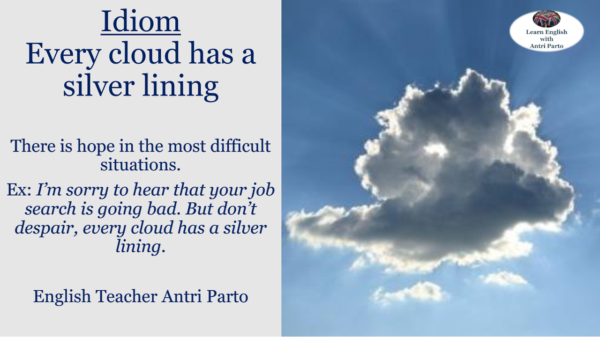

# The most dangerous road - Lesson 14

## Table of contents

- [**Warm up**](#warmup)
- [**Vocabulary**](#vocabulary)
- [**Grammar**](#grammar)

### Warm up 

**Do you have a habit of looking at bright sides? Why (not)? How often are you an optimist?**

---

### Vocabulary 

**Memorize some new words.**
- Military – военный, вооружённые силы
- Move as soon as possible – переехать как можно скорее
- Student government – студенческое самоуправление
- VP -> vice president – вице-президент
- Start over – начать заново
- Make friends – завести друзей
- Catch up on classwork – нагнать учёбу
- Get to know – узнать
- You didn’t make it – не получилось
- Jazz band – джаз группа
- Might – возможно
- Keep in touch – быть на связи
- Made me feel a lot better – заставили меня почувствовать себя намного лучше (не переводим дословно, т.е. вы меня поддержали; благодаря вам я чувствую себя получше

**Familiar words.**
- cathedral собор
- castle зАмок
- café кафе
- college колледж 
- cinema / movie theater (AmE) кинотеатр
- chemist / pharmacy (AmE) аптека
- coffee shop кофейня
- clothes shop магазин одежды
- bank банк
- building здание
- bookshop / bookstore книжный магазин
- fast food restaurant кафе быстрого питания
- hotel отель
- hospital больница
- ice rink / skating rink каток
- library библиотека
- market рынок
- museum музей
- pet shop зоомагазин
- playground дет.площадка
- park парк
- restaurant ресторан 
- school школа
- shop / store (AmE) магазин
- supermarket супермаркет
- sports centre / center (AmE) спорт центр
- square площадь, сквер
- theatre / theater (AmE) театр
- toy shop магазин игрушек
- university университет
- vet’s вет.книника

**Unfamiliar words.**
- butcher's [ˈbʊtʃə] мясная лавка
- bakery / baker's булочная 
- clock tower часовая башня
- church церковь
- dentist’s стоматология
- exchange office обменка
- foster care приёмная семья
- fair ярмарка (carnival/festival)
- funfair ярмарка с аттракционами
- fire station пожарная станция
- florist's цветочный магазин
- jewellery shop / jewelry store (AmE) [dʒuːəlri] ювелирный магазин
- maternity hospital / maternity [məˈtəːnɪti] home род.дом
- mosque [mɒsk] мечеть
- nursing home / retirement home / care home дом престарелых
- orphanage [ˈɔːf(ə)nɪdʒ] дет.дом
- optical shop оптика
- pawn shop [pɔːn] ломбард
- police station полицейский участок
- petrol station / gas station (AmE) заправка
- post office / mail office (AmE) почта
- register office ЗАГС
- shopping centre / mall (AmE) торговый центр
- shelter приют
- skyscraper [ˈskʌɪskreɪpə] небоскреб
- temple храм (висок как часть тела человека)
- train station ж/д станция
- town hall [taʊn] мэрия, ратуша, здание муниципалитета 

---

### Grammar 

> В русском, превосходная степень образуется через слово – самый. В английском иначе.

**Если 1 слог – добавляем суффикс -est:**
- clean – cleanest
- rich – richest
- smart – smartest

**Если прилагательное заканчивается на -e то добавляем только –st:**
- wide – widest
- safe – safest

**Если 1 гласная и 1 согласная, то удваиваем согласную, чтобы закрыть слог:**
- hot – hottest (hot + test)
- big – biggest (big + gest)
- **исключение new – newest (w – double u)**

**Если слово заканчивается на -y, меняем его на i:**

- easy – easiest
- busy – busiest
- happy – happiest

**Второй способ – слово ‘most’ к 2 и более сложным прилагательным:**
- attractive – the most attractive
- famous – the most famous
- expensive – the most expensive

> Как и в русском есть исключения ‘плохой – худший, так и в английском:
- good – better // лучше – the best // самый лучший (наилучший)
- bad – worse // хуже – the worst // самый худший
- much/many – more // больше – the most // самый большой
- little – less // меньше – the least // самый маленький
- far – farther (расстояние) / further (абстрактно) // дальше – the farthest / the furthest // самый дальний
- old – older (универсально) / elder (в семье) // старше / взрослее / старее – the oldest / the eldest // самый старший, взрослый

> Всегда добавляем артикль the, либо притяжательное местоимение

- It’s the cheapest book. It’s my cheapest book. // Это (моя) самая дешёвая книга.