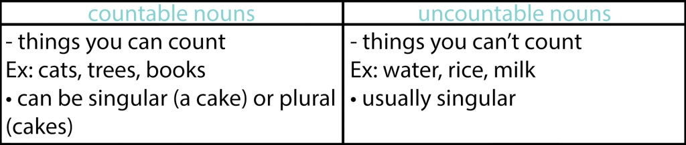
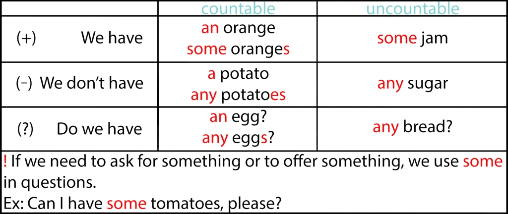
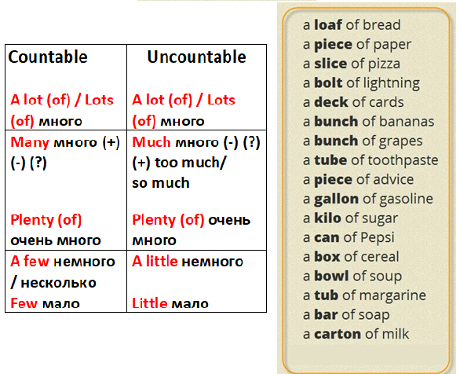
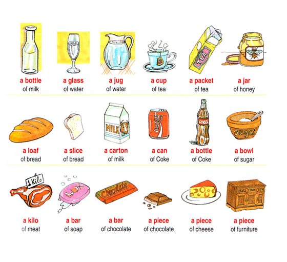

# Food - Lesson 9

## Table of contents

- [**Grammar**](#grammar)
- [**Vocabulary**](#vocabulary)

---

### Grammar 

**Исчисляемые (Countable)** что можно посчитать штучно. Один дом, два дома, пять домов, и т.д. Одно яблоко, четыре яблока, десять яблок (хотя для удобства мы и считаем в кг, но здесь ориентир на штуки).

**Неисчисляемые (Uncountable)** что не поддаётся поштучному счёту. Сыпучие (sugar, sand); тягучие (honey, pastry); жидкости (water, juice); твёрдые, металл, материал (iron, silver); абстрактные понятия (love, beauty); газообразные (gas, cloud).

**Сравните:**
**a glass** – стакан (изделие, считаем)
**some glass** – стекло (материал, не считаем)
**some glasses** – стаканы (мн.число, исчисляемое)
**some glasses** – ещё можно перевести как очки, тоже во мн.числе, но всегда неисчисляемое. Как быть с последними двумя?? В речи будем добавлять слово pair, a pair of glasses – пара очков (это изделие, т.е. одна пара, её и считаем).

> **! Помните** слова, которые всегда во мн. числе: clothes, jeans, trousers, pyjamas (Br) pajamas (Am), tights, shorts, scissors, binoculars, headphones, police.

> **всегда в единственном числе**:
> hair, money, news, advice, fruit, knowledge, information, furniture.
> (!!!) Все эти слова неисчисляемые.

**Extra information.**
Существительные, которые заканчиваются на –ics **единственные**:
economics, electronics, maths, politics, physics, aerobics.

Болезни **в единственном**: mumps, measles.

Мы думаем о сумме денег (a sum of money), периоде времени (a period of time), дистанции (a distance) как об одной вещи, поэтому мы используем форму глагола в **единственном** числе:

> Ex. Ten million dollars was stolen from the bank. 

Бывает и такое, что некоторые существительные в единственном числе употребляются вместе с формой глагола множественного числа.
Ex: audience – аудитория, committee – комитет, company – компания, family – семья, firm – фирма, government – государство, staff – коллектив, team – команда. Это так называемые **collective nouns** или собирательные имена существительные. Вы обратили внимание, что все эти слова называют одну вещь, однако состоят, как правило, из группы людей (семья, группа, команда – все эти явления не могут состоять из одного человека). И мы часто думаем об этих явлениях как о группе людей (they – они), поэтому мы и употребляем глагол в форме **множественного** числа.

> Ex: The government (they) don’t want to decrease taxes. 

Но также возможно с такими словами и употребление формы глагола для единственного числа, все зависит от того, какой смысл вы вкладываете в предложение. Если все члены группы, семьи, государства действуют в унисон, одинаково, делают одну вещь все вместе, то, как правило, мы говорим о них в **единственном** числе.

> Ex: The government wants to stop the war. 

Некоторые слова, которые заканчиваются на -s, могут быть **и единственным, и множественным** числом, как бы парадоксально это не звучало.

> Ex: Means (средство); a means of communication (средство общения); many means of communication (много средств общения)
> Series (серия); a TV series (телевизионный сериал); four TV series (4 телевизионных серии)
> Species (вид, класс); a species of animal (вид животных); 100 species of animals (100 видов животных). 

---

### Vocabulary 

- on the corner / at the corner - на углу
- at the traffic lights - на светофоре / у светофора
- opposite - напротив
- turn left - повернуть налево
- turn right - повернуть направо
- go straight on - идти прямо
- go past (the church) - пройти мимо (церкви)
- stop - остановиться
- go along the road - идти по улице
- go round the roundabout - выехать на дорогу с круговым движением
- cross the road - перейти дорогу
- go through - пройти через
- swimming pool бассейн
- road sign / traffic sign / street sign - дорожный знак
- at the bus stop - на остановке
- at the end of the street - в конце улицы
- a bridge - мост
- a pond [pɒnd] - пруд
- a river [ˈrɪvə] - река
- an ocean [ˈəʊʃ(ə)n] - океан
- a sea - море
- a hill - холм
- promenade [prɒməˈneɪd] - набережная. Ex: We strolled along on the promenade eating ice creams.
- in the street (BrE) on the street (AmE) на улице

**Ask for direction**

a. How do you get to the library? 
b. How do you get to the sports centre (sports center AmE)?  
c. How do you get to the statue? 
d. How do you get to the museum?

---

- to go across [əˈkrɒs] 
- get dressed - одеться
- go out - выйти из дома
- have a good time - хорошо провести время
- go to bed - идти спать
- have a swim - поплавать
- get home - добраться домой
- get a newspaper - купить газету
- have a drink - выпить
- go on holiday - выйти в отпуск
- have a sandwich - съесть
- go back - вернуться
- get a train - сесть на поезд

- At the traffic lights - на светофоре / у светофора
- Go along the road - идти по улице

---

1. What time do you usually have breakfast?
2. Who do you usually have breakfast with?
3. Where do you prefer to have lunch?
4. Do you like to cook? Why? Why not? 

---

**The girls are going down the steps**спускаются по лестнице.
**The woman is going up the stairs.** - Женщина поднимается по лестнице.
**The boy is in the window** - Мальчик в окне.
**The man is going into the house** - Мужчина заходит в дом
**The people are opposite (to) each other** - Люди напротив друг друга.
**The men are looking over the place** - Мыжчины осматривают место
**The baby is going towards the mother** - ребенок идет навстречу матери

----

- orphanage [ˈɔːf(ə)nɪdʒ] - дет. дом
- shelter [ˈʃɛltə] - приют
- pawn shop [ˈpɔːnʃɒp] - ламбард

**Breakfast**

- bread хлеб
- butter (сливочное) масло
- cereal [ˈsɪərɪəl] каша
- porridge [ˈpɒrɪdʒ] каша(отваренная)
- muesli [ˈm(j)uːzli]  мюсли
- cheese сыр
- coffee кофе
- eggs яйца
- jam джем, варенье
- (orange) juice (апельсиновый) сок
- milk молоко
- dairy [ˈderi] молочная продукция
- sugar сахар
- tea чай
- toast [toʊst] тост

**Vegetables**

- carrots морковь
- chips (Br) / French fries (Am) картофель фри
- *fish and chips - British national dish
- a lettuce лист салата
- mushrooms грибы
- onions лук
- garlic чеснок
- peas горох
- potatoes картофель
- tomatoes помидоры

**Lunch / dinner**

- fish рыба
- meat мясо (steak стейк / вырезка, chicken курица, sausage колбаса, sausages сосиски / сардельки, 
- ham ветчина)
- (olive) oil (оливковое) масло
- pasta паста
- rice рис
- salad салат

**Fruit**

- apples яблоки
- bananas бананы
- oranges апельсины
- a pineapple ананас
- strawberries клубника

**Desserts** [dɪˈzɜːrt] десерты

- *desert [ˈdezərt] пустыня
- cake торт / пирожное
- fruit фрукт
- ice cream мороженое

**Snacks** закуски

- biscuits (Br) / cookies (Am) печенье
- chocolate шоколад
- crisps (Br) / chips чипсы
- sandwiches бутерброды / сэндвичи
- sweets (Br) / candies (Am) сладости 

**Condiments** [ˈkɑːndəmənts] приправы 

- herbs [ˈɝːbz] травы
- spices [ˈspaɪsəz] специи

**Others**

- Oatmeal [ˈoʊtmiːl] овсянка
- Grain [ɡreɪn] - зерно
- Oat [oʊt] - овёс
- Wheat [wiːt] - пшеница
- roasted [ˈroʊstɪd] жареный / обожженный
- Corn [kɔːrn] - Кукуруза
- typically [ˈtɪpɪkli] - обычно

**Useful information**

Read how native speakers explain the difference between Cereal and Porridge.

> Cereal is dry, like cornflakes. Porridge is boiled, for example an oatmeal porridge.

> Porridge is a dish made from oatmeal or another meal or cereal that is boiled in water or milk. Cereal has two definitions: 1) it is a breakfast food made from a roasted grain ~ wheat, oats, rice, or corn ~ that is typically eaten cold with milk; or 2) it is a grain that is used for food, such as wheat, oats, or corn.

**Idioms**

- a piece of cake – Легче лёгкого

  > Ex. – We should save the planet. – It's a piece of cake.

- easy peasy (lemon squeezy) - Легче лёгкого

  > Ex. – This tongue twister is crazy. Can you really say it? - Easy peasy! 

